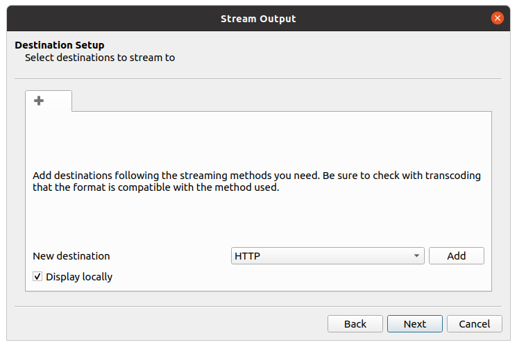
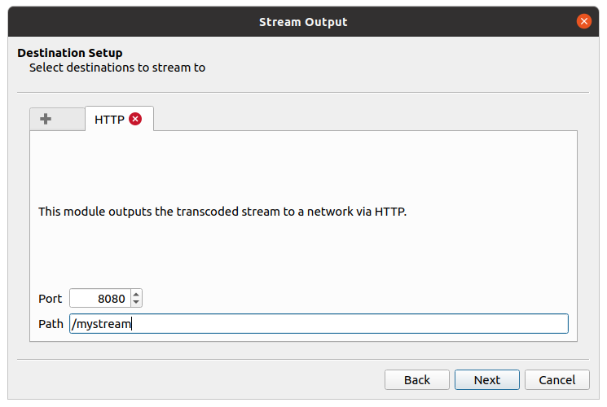
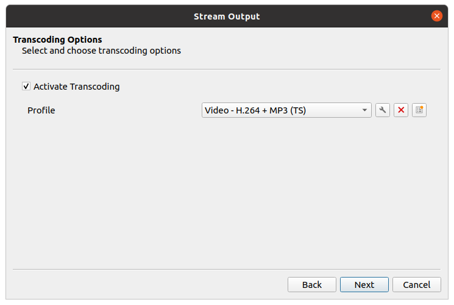
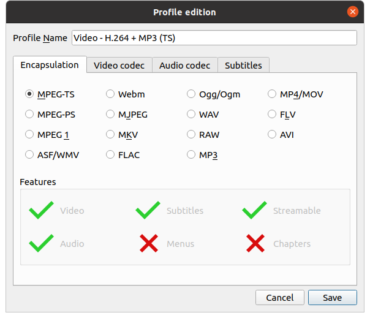
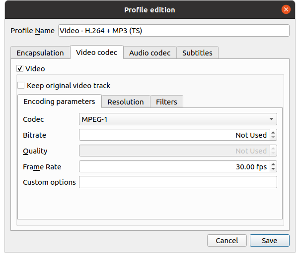

# How to simulate streams
So my dumbass dont forget


### Simulating rtsp streams with rtsp-simple-server
From: https://github.com/aler9/rtsp-simple-server

##### How
```
# start server
docker run --rm -it --network=host \
    -v /home/ernestlwt/Videos:/vids \
aler9/rtsp-simple-server

# serve a video on rtsp @ rtsp:localhost:8554/mystream
ffmpeg -re -stream_loop -1 -i /home/ernestlwt/Videos/ships.mp4 -c copy -f rtsp rtsp://localhost:8554/mystream

# serve a webcam
ffmpeg -f v4l2 -i /dev/video0 -pix_fmt yuv420p -preset ultrafast -b:v 600k -f rtsp rtsp://localhost:8554/mystream
```

### simulating mpeg stream via http with vlc
1. Open VLC and got to `Media` > `Stream...`
2. For videos, click on `Add...` and select video
3. For webcam, click on the `Capture Device` tab and change the video device name to `/dev/video0` or accordingly
4. Click on `Stream` then `Next`
5. At `Destination Setup`, check `Display locally` and change the new destination to `HTTP` and click on Add



6. Enter port and path accordingly



7. Change Profile to `Video - H.264 + MP3 (TS)`



8. Click on the Spanner icon and under the `Encapsulation` tab, select `MPEG-TS`



9. Under `Video Codec` select `MPEG-1`. Click on `Save`.



10. Click on `Next`, and `Stream`on the next page

### Using openCV to get the latest frame from stream
Check out `video_capture.py`. It keeps grabbing the latest frame and only retrive the latest frame when called. Explaination [here](https://stackoverflow.com/a/69141497)
