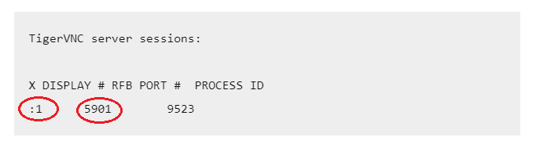
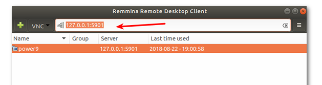

# How to Install and use TigerVNC


## Setup Steps
1.  Install Ubuntu dependencies
    ```
    # required
    sudo apt install tigervnc-standalone-server tigervnc-xorg-extension tigervnc-viewer
    ```
1. Setup VNC password
    ```
    vncpasswd
    ```
1. Start VNC server
    ```
    vncserver
    ```
1. Check VNC session
    ```
    vncserver -list
    ```
    Sample image:

    
    
    Note the display number and port number
1. Stop VNC server
    ```
    vncserver -kill :<display number>
    ```

## Connecting Steps
1. Copy ssh key over onto server
    ```
    sshy-copy-id -i ~/.ssh/<your key> <remote user>@<remote host>
    ```

1. Bind remote user port to local port
    ```
    ssh <remote user>@<remote host> -L <vnc port number>:127.0.0.1:<local port>

    # Example
    ssh user@10.0.0.1 -L 5901:127.0.0.1:5901
    ```

1. Open remmina, switch to VNC and enter the address you set earlier
    Sample Image:
    
    

    You are done!

## Notes
1. Go to the host and close any existing google chrome. Because google chrome will run on the same display if there is any existing instances. So we make sure all are closed, then we are able to use it on the remote desktop display
1. You will need an existing open ssh session. So if you cannot connect via Remmina, open a new terminal, ssh into the server and leave the terminal open, then try Remmina again